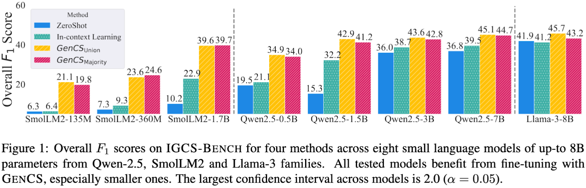
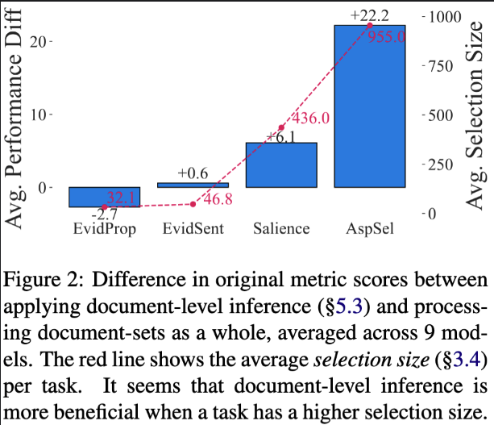

# 📝 Instruction Guided Content Selection (IGCS)

This repo contains the code and dataset for the TACL paper **"A Unifying Scheme for Extractive Content Selection Tasks"**.

* How to use the library? follow the [getting started](#-getting-started) to use the igcs library for extractive content selection.
* How to reproduce? If you wish to use or reproduce our work, follow the [datasets](#-datasets), [models](#-trained-models) and [training](#-training) sections below.


## 💡 Motivation

Many NLP tasks require selecting relevant text spans from given source texts. 
Despite this shared objective, such content selection tasks have traditionally been studied in isolation, 
each with its own modeling approaches, datasets, and evaluations.

Instruction Guided Content Selection (IGCS) unifies many tasks such as extractive summarization, 
evidence retrieval and argument mining under the same scheme of selecting extractive spans in given sources.

## 📊 Key Findings

1. Training with a diverse mix of content selection tasks helps boost LLM performance even on new extractive tasks. Generic transfer learning at its best!



2. For tasks requiring longer selections, LLMs consistently perform better when processing one document at a time instead of the entire set at once. This is not so much the case for tasks with short selections.


Check out the paper for more info!

# 🚀 Getting Started

## 📦 Installing igcs Python package

First install the igcs library (requires Python >= 3.11):

```bash
pip install -U igcs
```

Or install with full dependencies for training, inference and reproduction:

```bash
pip install 'igcs[train]'
```

To develop this library, install with `develop` extras:


```
pip install 'igcs[develop]'
```

## 🛠️ Full Example Usage

Additional example, including the [demo space]() hosted in huggingface's spaces are in the [./examples/](./examples) dir.

Prepare the prompt, call a model, parse the response and ground the selections:

```python
from igcs import grounding
from igcs.entities import Doc
from openai import OpenAI

selection_instruction = "Select content related to Obama's non-presidential roles"
docs = [
    Doc(id=0,
        text="Barack Hussein Obama II[a] (born August 4, 1961) is an American politician who was the 44th president of the "
        "United States from 2009 to 2017. A member of the Democratic Party, he was the first African American president. "
        "Obama previously served as a U.S. senator representing Illinois from 2005 to 2008 and as an Illinois state senator "
        "from 1997 to 2004.",
        ),
    Doc(id=1,
        text="In 1991, Obama accepted a two-year position as Visiting Law and Government Fellow at the University of Chicago "
        "Law School to work on his first book.[63][65] He then taught constitutional law at the University of Chicago Law School "
        "for twelve years, first as a lecturer from 1992 to 1996, and then as a senior lecturer from 1996 to 2004.[66]",
    ),
]

# 1. Prepare the input prompt and documents

prompt = (
    f"Given the following document(s), {selection_instruction}. "
    f"Output the exact text phrases from the given document(s) as a valid json array of strings. " 
    f"Do not change the copied text.\n\n"
    + "\n\n".join([f"Document #{doc.id}:\n{doc.text.strip()}\n" for doc in docs])
)

# 2. Generate selection with any model (see training models below). This examples uses the free OpenRouter:
client = OpenAI(base_url="https://openrouter.ai/api/v1", api_key="<OPENROUTER_API_KEY>")

completion = client.chat.completions.create(
    model="moonshotai/kimi-k2:free",
    messages=[{"role": "user", "content": prompt}],
    temperature=0.0,
)
resp = completion.choices[0].message.content

# 3. Ground the selected spans

selected_spans = grounding.parse_selection(resp)
selections = grounding.ground_selections(
    selected_spans,
    docs=docs,
    # controls fuzzy matching sensitivity
    max_dist_rel=0.15,
    max_dist_abs=10,
)
print(selections)
```


Expected output (`mode` can be either exact, normalized, fuzzy match or hallucination):

```python
[
    Selection(doc_id=0, start_pos=250, end_pos=302, content='U.S. senator representing Illinois from 2005 to 2008', metadata={'total_count': 1, 'mode': 'exact_match'}),
    Selection(doc_id=0, start_pos=313, end_pos=353, content='Illinois state senator from 1997 to 2004', metadata={'total_count': 1, 'mode': 'exact_match'}),
    Selection(
        doc_id=1,
        start_pos=47,
        end_pos=121,
        content='Visiting Law and Government Fellow at the University of Chicago Law School',
        metadata={'total_count': 1, 'mode': 'exact_match'}
    ),
    Selection(
        doc_id=1,
        start_pos=165,
        end_pos=335,
        content='taught constitutional law at the University of Chicago Law School for twelve years, first as a lecturer from 1992 to 1996, and then as a senior lecturer from 1996 to 2004',
        metadata={'total_count': 1, 'mode': 'exact_match'}
    )
]
```


# 🤖 Trained Models

Huggingface trained models from the paper can be found at [Huggingface Hub](https://huggingface.co/collections/shmuelamar/igcs-instruction-guided-content-selection-687c92705699bb4a7ae0045e).


# 🗂️ Datasets

All dataset files found under [./igcs-dataset](./igcs-dataset) dir splitted into train, dev and test.
To prepare OpenAsp data which is currently only contains placeholders (as it contains licensed DUC datasets), 
please run the following script after obtaining OpenAsp dataset from the [OpenAsp GitHub repo](https://github.com/liatschiff/OpenAsp).

The script requires the OpenAsp directory (by default called `openasp-v1`) will replace files inplace, use `--help` for more info:

Note: don't forget to install extra requirements with `pip install -U igcs[train]` to build the datasets.

```bash
python scripts/prepare_openasp_files.py ./OpenAsp/openasp-v1
```

## 📈 Predicting with IGCSBench and GenCS

To predict on IGCSBench or GenCS (called ReverseInstructions here) dataset, use the following command:

use --help for more details on different prediction modes.

```bash
python src/igcs/predict.py \
  -i 'OpenAsp/test' 'AspectNews/test' 'SciFact/test' 'DebateSum/test' 'SaliencyDetection/test' 'EvidenceDetection/test' 'ReverseInstructions/test' \
  --model "GPT4" 
```

Full help script for commands:

```text
usage: predict.py [-h] [--mode MODE] -i INFILE [INFILE ...] -m MODEL [-o OUTFILE] [-n NUM_SAMPLES] [--skip-eval] [--shuffle] [--dry-run] [--icl-num-samples ICL_NUM_SAMPLES]
                  [--icl-samples-from-eval] [--randomize-icl-samples] [--prompt-variant PROMPT_VARIANT]

options:
  -h, --help            show this help message and exit
  --mode MODE           One of zeroshot (default), icl (in-context learning), single_doc (one source document at a time), or icl_single_doc for the last two modes combined.
  -i INFILE [INFILE ...], --infile INFILE [INFILE ...]
                        Input prompts file in JSON-Lines format for prediction.file can be also a predefined dataset such as OpenAsp/test
  -m MODEL, --model MODEL
                        Model to predict results on
  -o OUTFILE, --outfile OUTFILE
                        Output predictions file in JSON-Lines format. The scripts adds `selection` key to every row in the input file, keeping other keys intact.
  -n NUM_SAMPLES, --num-samples NUM_SAMPLES
                        Predict only on the first n samples specified. Defaults to all samples.
  --skip-eval           If set, disable evaluation step at end.
  --shuffle             If set, shuffles predicted samples. Can be combined with --num-samples.
  --dry-run             If set, does not predict but only prints prompts.
  --icl-num-samples ICL_NUM_SAMPLES
                        Number of samples from the train set to include in in-context learning mode. Only relevant if mode is icl
  --icl-samples-from-eval
                        When set uses ICL samples from the eval set (required for datasets without train set)
  --randomize-icl-samples
                        Whether to randomize per eval sample the ICL samples or use the same samples for all the eval set
  --prompt-variant PROMPT_VARIANT
                        The index of the prompt template variant to use
```

## 🔄 Recreating IGCSBench and GenCS

Please follow the code in [./src/igcs/datasets](src/igcs/datasets) for recreating IGCSBench and GenCS.


# 🏋️‍♂️ Training

Example training of Llama-3-8B-Instruct on GenCS-Union dataset.

Note: don't forget to install extra requirements with `pip install -U igcs[train]` to train.


```bash
export CUDA_VISIBLE_DEVICES=4,5,7
nohup 2>&1 accelerate launch --main_process_port 31337 src/igcs/train_model/__init__.py     \
    --output_dir "my-trained-model"   \
    --train_dataset  'ReverseInstructions'  \
    --dataset_dir './igcs-dataset/prompts'     \
    --model_name 'meta-llama/Meta-Llama-3-8B-Instruct'   \
    --gradient_accumulation_steps 1 \
    --batch_size 4 \
    --seq_length 4096 \
    --num_train_epochs 3   \
    --evaluation_strategy "no" \
    --neftune_noise_alpha 5.0 \
    --warmup_ratio 0.06 > "train_${MODEL_CODENAME}.log" &
```

# ⚖️ License

The code in this repo is available under MIT and APACHE2 dual license mode.
All datasets are provided and can be used according to their original licensing - please verify that before using them.

## 🤝 Contributing
Contributions and pull requests are welcome - feel free to open a PR.
Found a bug or have a suggestion? Please file an issue.
